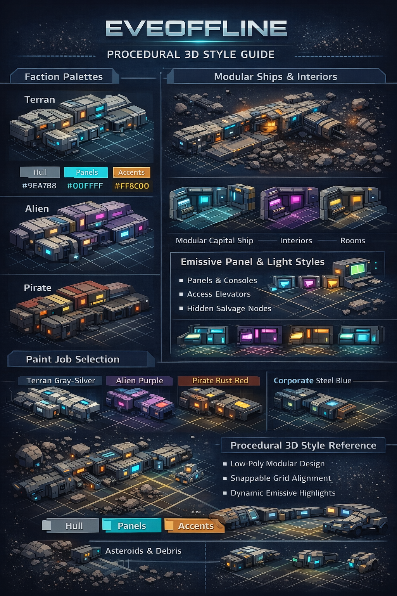
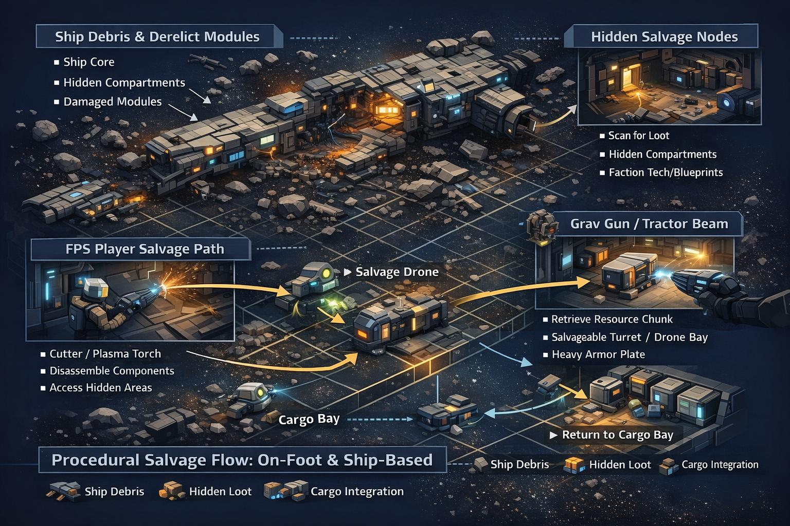
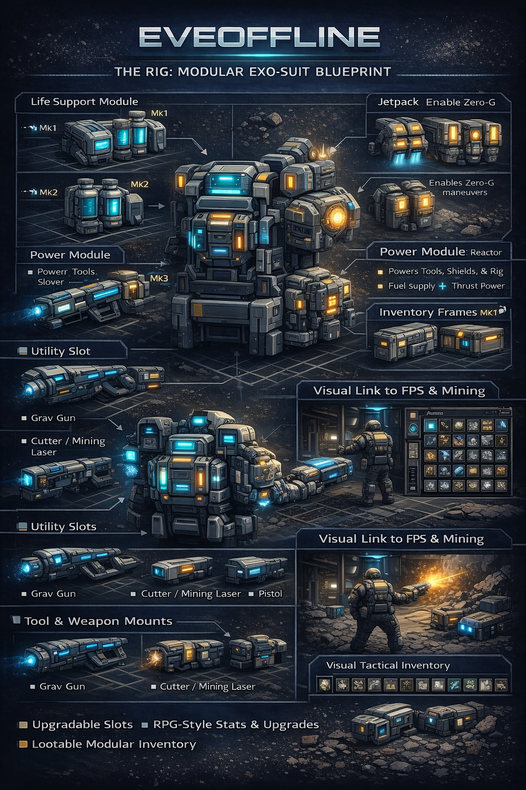
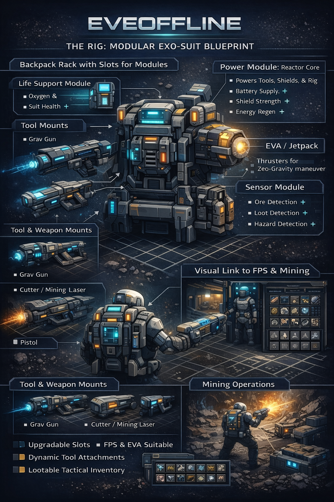
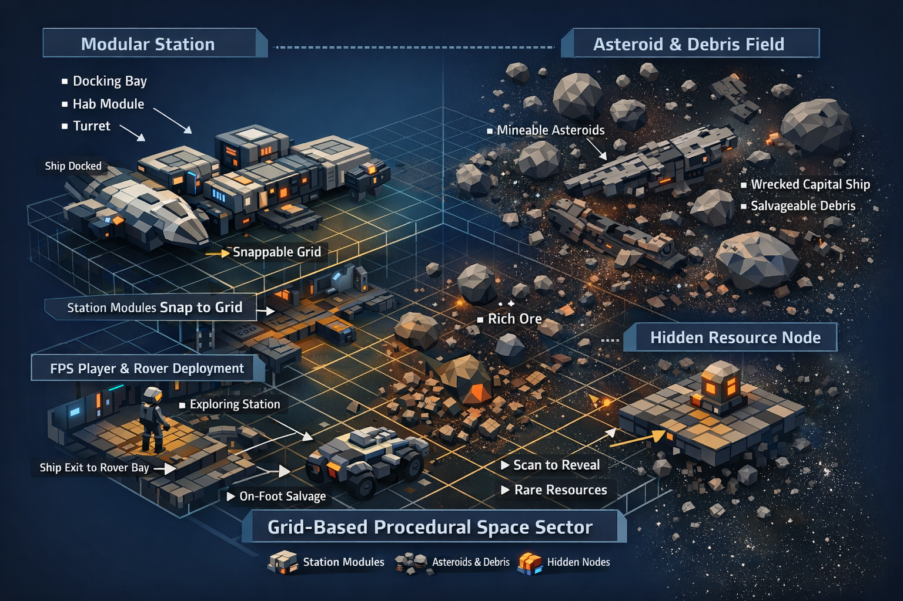
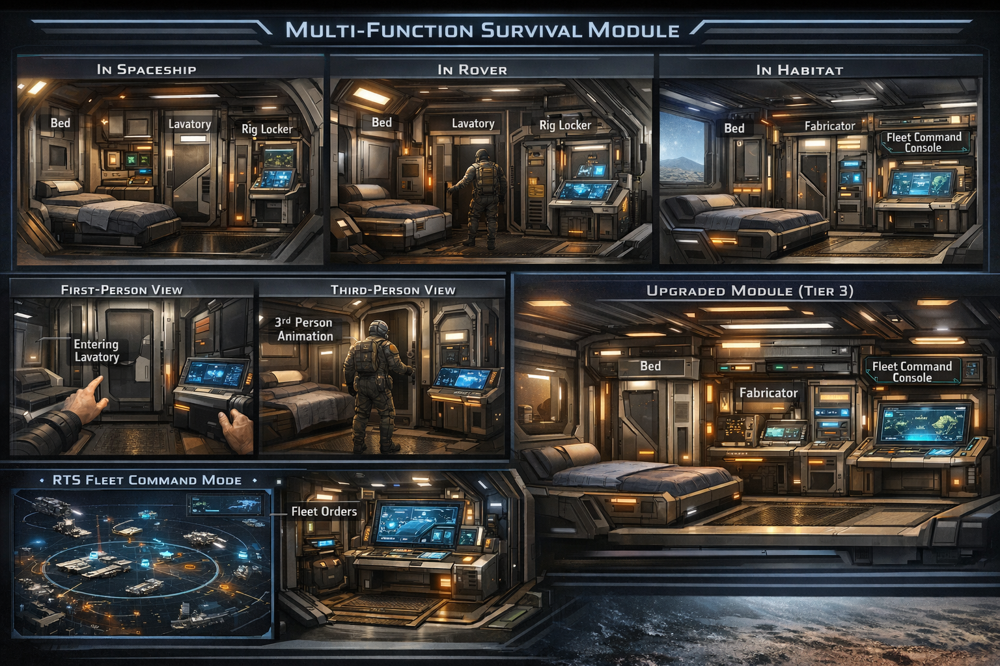

<p align="center">
  
</p>

A PVE-focused space simulator for small groups (2–20 players) or solo play with AI wingmates.
Built with **C++ / OpenGL** and the custom **Atlas UI** framework — an immediate-mode, GPU-accelerated UI system designed for sci-fi cockpit interfaces.

> **Status** — Active R&D · Builds on Linux, macOS, Windows

---

## ✨ At a Glance

<p align="center">
  
</p>

<p align="center">
  
</p>

<p align="center">
  
</p>

<p align="center">
  
</p>

<p align="center">
  
</p>

<p align="center">
  
</p>

---

## 🚀 Quick Start

### Prerequisites

- **CMake** 3.15+
- **C++17** compiler (GCC 9+, Clang 10+, MSVC 2019+)
- **Libraries**: GLFW3 · GLM · GLEW · nlohmann-json · OpenAL (optional)

### Linux / macOS

```bash
# Ubuntu/Debian
sudo apt-get install build-essential cmake \
  libgl1-mesa-dev libglew-dev libglfw3-dev libglm-dev \
  nlohmann-json3-dev libopenal-dev libfreetype-dev

# macOS
brew install cmake glfw glm glew nlohmann-json openal-soft freetype

# Build & run
./build.sh
cd build/bin && ./eve_client "YourName"
```

### Windows (Visual Studio)

```cmd
:: Install dependencies via vcpkg
vcpkg install glfw3:x64-windows glm:x64-windows glew:x64-windows ^
              nlohmann-json:x64-windows freetype:x64-windows

:: Generate & open solution
build_vs.bat --open
```

### CMake (any platform)

```bash
mkdir build && cd build
cmake .. -DCMAKE_BUILD_TYPE=Release -DUSE_SYSTEM_LIBS=ON
cmake --build . --config Release
```

---

## 🗂️ Project Structure

```
Atlas/
├── engine/                # ★ Atlas Engine — generic, game-agnostic core
│   ├── core/              #   Engine bootstrap, logging, config
│   ├── ecs/               #   Entity/Component/System framework
│   ├── graphvm/           #   Deterministic Graph VM + compiler
│   ├── assets/            #   Asset registry, binary format, hot reload
│   ├── net/               #   Networking (CS + P2P + lockstep/rollback)
│   ├── sim/               #   Tick scheduler, deterministic simulation
│   └── world/             #   World layouts (cube-sphere, voxel grid)
├── editor/                # ★ Atlas Editor — authoring tool
│   ├── ui/                #   Docking, layout, panel system
│   ├── panels/            #   ECS Inspector, Net Inspector, Console
│   ├── tools/             #   Game Packager, Asset Cooker
│   └── ai/                #   AI Aggregator for asset generation
├── atlas_tests/           # Atlas Engine unit tests
├── cpp_client/            # C++ OpenGL game client
│   ├── src/               #   Source (core, rendering, network, ui, audio)
│   ├── include/           #   Headers
│   │   └── ui/atlas/      #   ★ Atlas UI framework headers
│   ├── shaders/           #   GLSL shaders
│   └── assets/            #   Models, textures
├── cpp_server/            # C++ dedicated game server
│   ├── src/               #   Server source (ECS, network, systems)
│   └── config/            #   Server configuration
├── data/                  # Game data — fully moddable JSON
│   ├── ships/             #   102+ ship definitions
│   ├── modules/           #   159+ module definitions
│   ├── missions/          #   Mission templates (5 levels, 7 types)
│   ├── universe/          #   Solar systems, stargates, stations
│   └── ...                #   Skills, NPCs, market, industry, etc.
├── docs/                  # Documentation
│   ├── atlas-ui/          #   ★ Atlas UI framework docs
│   ├── guides/            #   Build & setup guides
│   └── ...                #   Design, features, development notes
├── tools/                 # Utilities (ship creator, JSON validator, Blender addon)
│   └── BlenderSpaceshipGenerator/  # Blender addon for procedural ship/station generation
├── archive/               # Legacy code & deprecated files
├── ATLAS_INTEGRATION.md   # ★ Atlas Engine integration guide
├── CMakeLists.txt         # Root build configuration
├── build.sh / build.bat   # Build scripts
└── Makefile               # Development task shortcuts
```

---

## 🎨 Atlas UI Framework

Atlas is both the game **and** its UI framework. The Atlas UI system is a custom, immediate-mode, GPU-accelerated UI toolkit built specifically for sci-fi game interfaces — and designed to be reusable in other projects.

**→ [Full Atlas UI Documentation](docs/atlas-ui/README.md)**

### Key Features

- **Immediate-mode API** — no retained widget trees; simple `if (button(...))` pattern
- **Single draw-call batching** — all UI rendered in one GPU pass
- **EVE-style widget set** — panels, status arcs, capacitor rings, module racks, overview tables
- **Interactive** — drag-to-move panels, click buttons, tab switching, scrolling
- **Themeable** — full color scheme support (default teal, classic amber, colorblind-safe)
- **Zero dependencies** beyond OpenGL 3.3

### Quick Example

```cpp
#include "ui/atlas/atlas_context.h"
#include "ui/atlas/atlas_widgets.h"

atlas::AtlasContext ctx;
ctx.init();

// Each frame:
atlas::InputState input = getInputFromGLFW();
ctx.beginFrame(input);

atlas::Rect panelBounds = {100, 100, 300, 200};
if (atlas::panelBegin(ctx, "My Panel", panelBounds)) {
    if (atlas::button(ctx, "Click Me", {110, 140, 80, 24})) {
        // handle click
    }
    atlas::progressBar(ctx, {110, 170, 200, 16}, 0.75f,
                       ctx.theme().shield, "Shield: 75%");
}
atlas::panelEnd(ctx);

ctx.endFrame();
```

---

## 🔩 Atlas Engine

This project includes the **Atlas Engine** — a modular, data-driven game engine core that powers both the client and server. **EVEOFFLINE remains a standalone game project where gameplay features are developed and tested first**; stable, game-agnostic pieces can then be implemented in [Atlas](https://github.com/shifty81/Atlas) for further engine-level development.

**→ [Atlas Integration Guide](ATLAS_INTEGRATION.md)**

### Engine Components

| Module | Description |
|--------|-------------|
| **ECS** | Entity/Component/System framework with type-safe component management |
| **Graph VM** | Deterministic bytecode virtual machine for gameplay logic |
| **Asset System** | Binary asset format, registry, hot reload |
| **Networking** | Client-Server + P2P, lockstep/rollback, peer management |
| **Simulation** | Fixed-rate tick scheduler, deterministic time |
| **World Gen** | Cube-sphere (planetary) and voxel grid layouts with LOD |
| **Editor** | Panel docking, ECS inspector, console, game packager |

### Build Atlas Engine Tests

```bash
make test-engine
# or
mkdir build && cd build
cmake .. -DBUILD_ATLAS_ENGINE=ON -DBUILD_ATLAS_TESTS=ON -DBUILD_CLIENT=OFF -DBUILD_SERVER=OFF
cmake --build .
./atlas_tests/AtlasTests
```

---

## 🎮 Game Features

### Four Factions

| Faction | Style | Specialty |
|---------|-------|-----------|
| **Solari** | Golden / elegant | Armor tanking, energy weapons |
| **Veyren** | Angular / utilitarian | Shield tanking, hybrid turrets |
| **Aurelian** | Sleek / organic | Speed, drones, electronic warfare |
| **Keldari** | Rugged / industrial | Missiles, shields, ECM |

### Ship Classes
Frigates · Destroyers · Cruisers · Battlecruisers · Battleships · Capitals
Tech I · Tech II (Interceptors, Covert Ops, Assault Frigs, Stealth Bombers, Marauders, Logistics, Recon, Command Ships)
Industrials · Mining Barges · Exhumers · Carriers · Dreadnoughts · Titans

### Game Systems
- **Combat** — Module activation, target locking, damage types, electronic warfare
- **Movement** — Approach, orbit, keep-at-range, warp, align (EVE-style)
- **Fleet** — Party system with AI or human wingmates
- **Skills** — 137 skills across 20 categories with attribute-based training
- **Industry** — Mining, manufacturing, market, contracts
- **Exploration** — Probe scanning, deadspace complexes, wormholes
- **Missions** — 5 levels × 7 types (combat, mining, courier, trade, scenario, exploration, storyline)

---

## 🔧 Modding

All game content lives in `data/` as JSON files — fully moddable:

```bash
data/
├── ships/              # Ship stats, slots, bonuses
├── modules/            # Weapons, defenses, utilities
├── skills/             # Training requirements and bonuses
├── missions/           # Mission templates and objectives
├── npcs/               # NPC spawns and AI behavior
├── universe/           # Solar systems and celestials
├── market/             # Economy and pricing
└── ...                 # Industry, exploration, corps, security
```

**Tools**: `tools/validate_json.py` (validate data) · `tools/create_ship.py` (ship wizard) · `tools/BlenderSpaceshipGenerator/` (procedural 3D ship generation)

See the [Modding Guide](docs/MODDING_GUIDE.md) for details.

---

## 🗺️ Roadmap

> **[Full Roadmap →](docs/ROADMAP.md)** — Detailed milestones, ECS specs, and implementation status

<table>
<tr>
<td width="50%" valign="top">

### ✅ Completed

| Phase | Milestone | Status |
|:-----:|-----------|:------:|
| 1 | **Core Engine** — ECS, networking, tick-based sim | ✅ |
| 2 | **Content** — 102 ships, 159 modules, 137 skills | ✅ |
| 3 | **Economy** — Manufacturing, market, exploration, loot | ✅ |
| 4 | **Social** — Corps, contracts, mail, chat | ✅ |
| 5 | **3D Graphics** — OpenGL client, PBR, particles, audio | ✅ |
| 6 | **Tech II** — HAC, Recon, Logistics, capitals, L5 missions | ✅ |
| 7 | **Industry** — Mining, PI, invention, wormholes, fleet | ✅ |

</td>
<td width="50%" valign="top">

### 🚧 Next Up

| Phase | Milestone | Focus |
|:-----:|-----------|:-----:|
| 🎯 | **Vertical Slice** — One full star system, playable loop | 🔜 |
| 8 | **Cinematic Warp** — Tunnel shaders, audio, anomalies | 📋 |
| 9 | **Fleet AI** — Captain personalities, morale, chatter | 📋 |
| 10 | **Tactical Overlay** — 2.5D strategy view, distance rings | 📋 |
| 11 | **Fleet Civilization** — 25-ship fleets, station deployment | 📋 |
| 12 | **Ship Gen v2** — Spine-based hulls, silhouette-first design | 📋 |

</td>
</tr>
</table>

<details>
<summary><strong>🔭 Vision — Where This Is Going</strong></summary>
<br>

**Warp as ritual, not loading screen** — Long warps become meditative experiences with layered audio, visual anomalies, and fleet chatter. Ships warp in formation; captains talk about victories, losses, and rumors.

**Fleet members are people** — AI captains have personality axes (aggression, optimism, humor), form friendships and grudges, track morale, and may leave if conditions worsen. Their chatter shifts across mining, combat, exploration, and idle states.

**Tactical overlay for spatial mastery** — A passive 2.5D strategy view shows true distances, tool ranges, and entity positions without clutter or interaction. Information > spectacle.

**Traveling civilizations** — At 25 ships with titans and capitals, your fleet becomes a moving polity with distributed economy, station deployment, and fleet-scale industry. Titan is a civilizational threshold, not just the next ship.

**Ships that read in silhouette** — Procedural generation overhaul: spine-based hull grammar (Needle, Wedge, Hammer, Slab, Ring) with functional zones and faction shape language, replacing blob-assembly.

</details>

---

## 📚 Documentation

| Category | Links |
|----------|-------|
| **Get Started** | [Tutorial](docs/TUTORIAL.md) · [Build Guides](docs/guides/) |
| **Atlas Engine** | [Integration Guide](ATLAS_INTEGRATION.md) · [Atlas Repo](https://github.com/shifty81/Atlas) |
| **Atlas UI** | [Atlas UI Docs](docs/atlas-ui/README.md) · [Widget Reference](docs/atlas-ui/WIDGETS.md) |
| **Development** | [Roadmap](docs/ROADMAP.md) · [Contributing](docs/CONTRIBUTING.md) |
| **Design** | [Game Design](docs/design/DESIGN.md) · [Ship Modeling](docs/SHIP_MODELING.md) |
| **Technical** | [C++ Client](docs/cpp_client/) · [Networking](docs/cpp_client/) |

---

## 🤝 Contributing

Contributions are welcome! See [CONTRIBUTING.md](docs/CONTRIBUTING.md).

## 📝 License

[To be determined]

---

<sub>Atlas is an indie PVE space simulator. All in-game content uses original naming conventions. Not affiliated with CCP Games.</sub>
